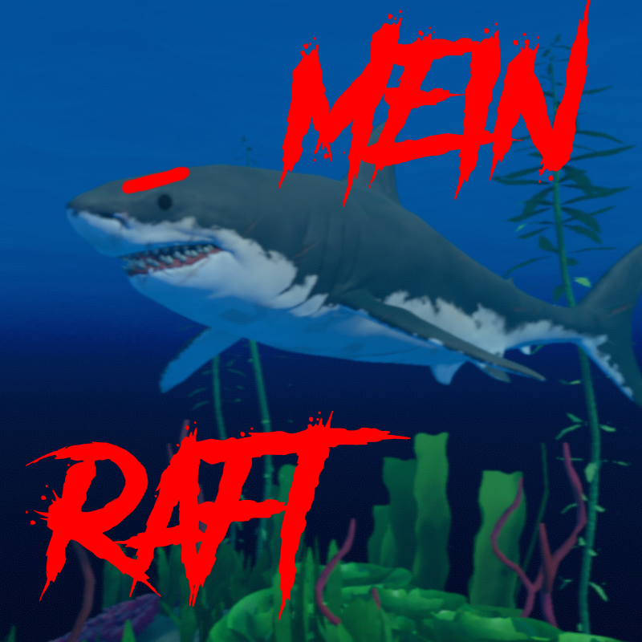

    

<h1 align="center">Mein Raft</h1>

Enhance your Raft experience with Mein Raft, a modification that adds new features.

    
      
    
     
    
      
    
    
     
    
     

## Disclaimer

This project is not affiliated with or endorsed by Raft, Redbeet Interactive, Axolot Games, or any of their affiliates. The use of 
this software is at your own risk. The developers of this project are not responsible for any damages or losses caused 
by the use of this software. This project is intended for educational purposes only.

## Getting Started

### Prerequisites

- [Raft](https://store.steampowered.com/app/648800/Raft/) (Steam version)
- [MelonLoader](https://melonwiki.xyz/#/README) (latest version)
- [UrGUI](https://github.com/Lyzev/UrGUI/tree/main?tab=readme-ov-file#getting-started) (latest version)

### Installation

1. Download the latest release of SchummelPartie from the [releases page](https://github.com/Lyzev/MeinRaft/releases).
2. Put the downloaded `MeinRaft.dll` file into the `Mods` folder of your Pummel Party installation.
3. Run the game and enjoy the mod!

### Contributing

Thank you for considering contributing to this Raft hacked client! Your contributions will help to make it even better.

#### How to set up the development environment

1. Clone the repository.
2. Open the solution in your preferred IDE (e.g.: Rider, Visual Studio).
3. Done!

**NOTE:**  
*The project is built with .NET 4.8. You will need to have it installed to build the project.  
Don't forget to install the prerequisites mentioned in the "Prerequisites" section.*

## Bugs and Suggestions

### Discord

For assistance with minor concerns, feel free to join our supportive community on
the [Discord server](https://lyzev.dev/discord). Our friendly members and staff are ready to help you.

### GitHub

To ensure a prompt and effective resolution of bugs or to share your suggestions, please submit them through
the [issue tracker](https://github.com/Lyzev/MeinRaft/issues) of this repository. Kindly utilize the provided templates
and make sure to include all relevant details that would help us understand your issue better. Your cooperation is
greatly appreciated.
